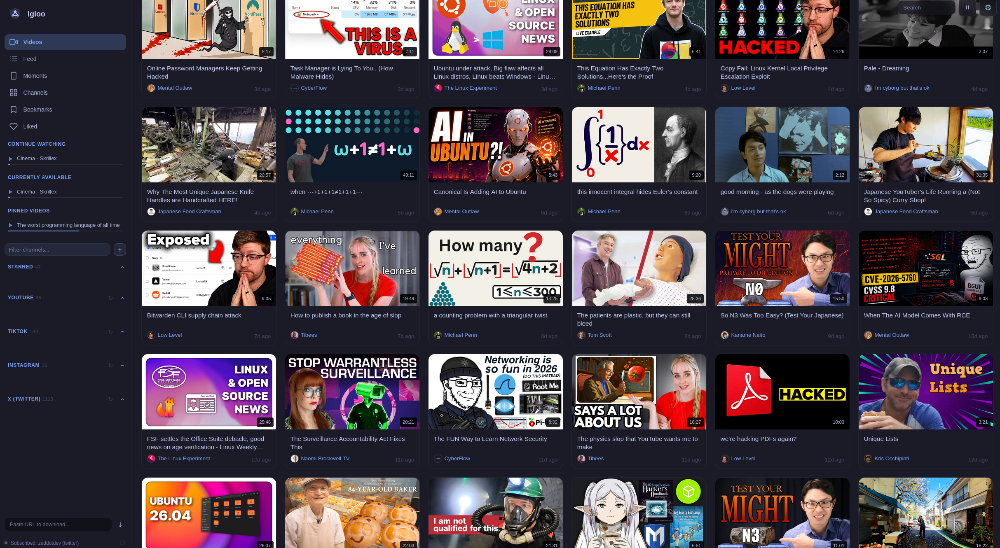
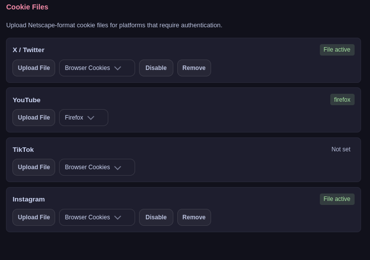
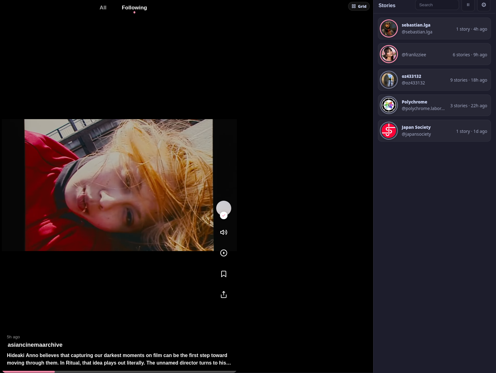
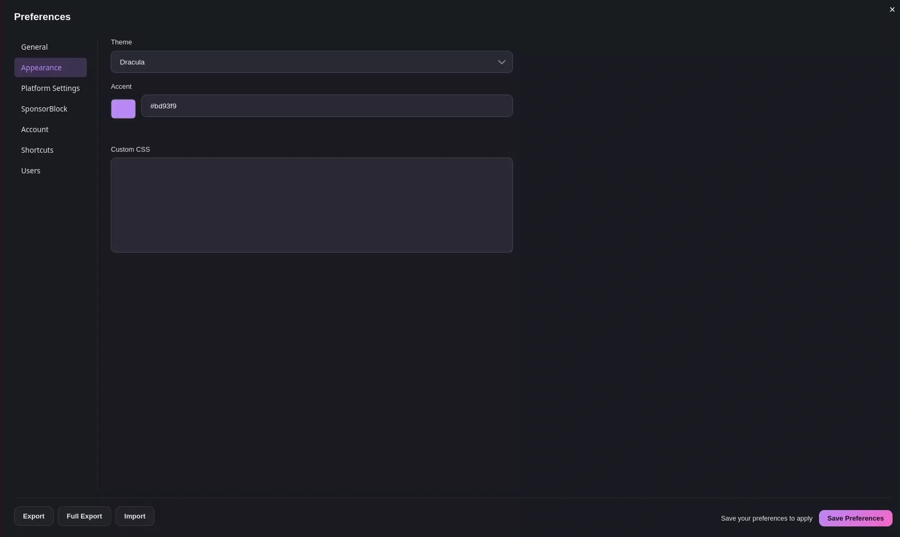
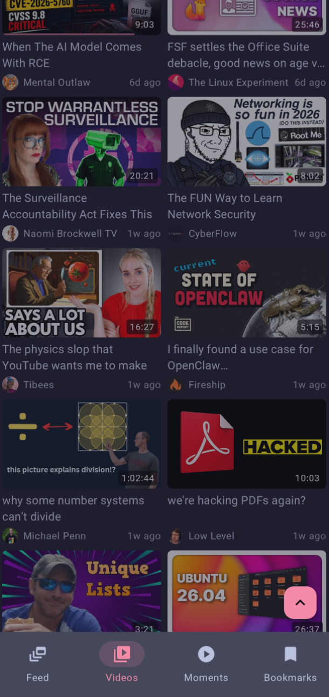
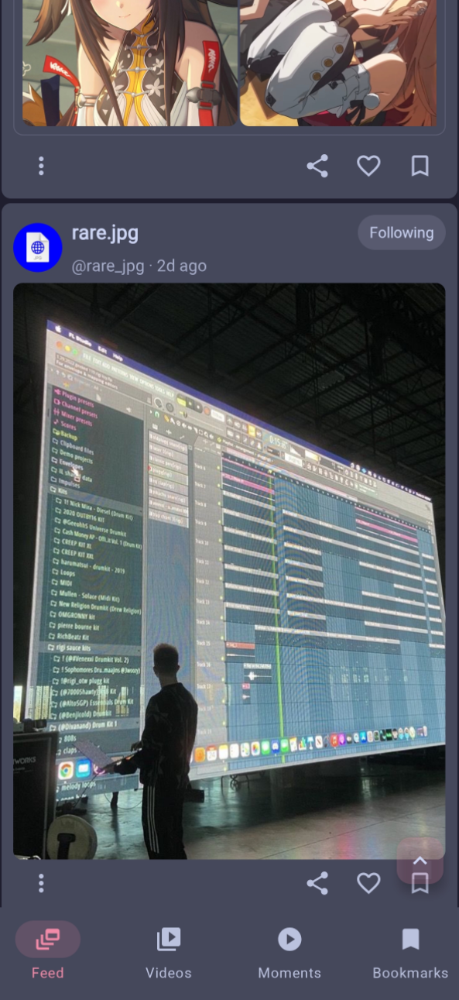
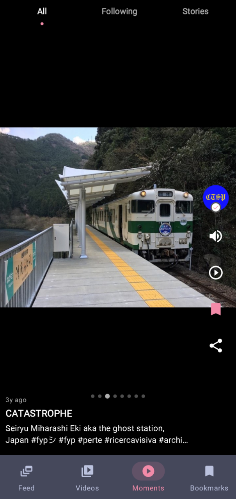
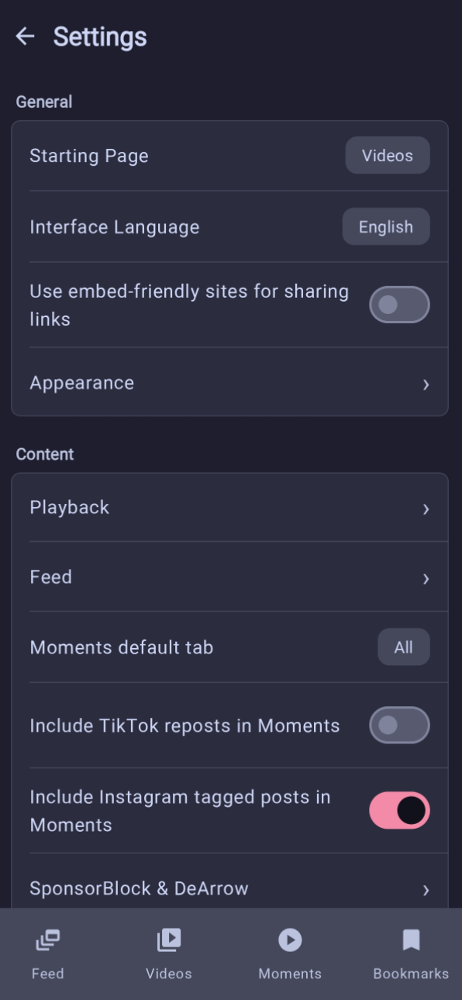
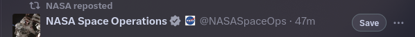

# Igloo 

<p align="center">
  
</p>

<p align="center">
  
  
  
</p>



Igloo is an opinionated self-hosted personal social inbox for X, YouTube, TikTok and Instagram written in [Go](https://go.dev/). It pulls content from imported creators, and syncs it to an offline-first Android app. It is not meant to be a complete front-end replacement for these services, it intentionally stays out of any interaction with these platforms, such as posting or commenting. The published image is built with Nix to keep it small, 200~ MB compressed and 700~ MB local image size. You can also build the image yourself. [Jump to installation](#install)


Any interaction you do on the client, stays in your machine which includes likes, follows or bookmarks. You don't need to log in to your accounts on these platforms, but that can also affect what media the server can fetch, since it uses [yt-dlp](https://github.com/yt-dlp/yt-dlp) and [gallery-dl](https://github.com/mikf/gallery-dl) to download media, you can only go as far as these packages let you go without cookies. On the web UI, you can upload a cookie file or set the browser with cookies to automatically enable cookies.



You can import your NewPipe subscriptions directly, or add any subscriptions one by one through the site by an account/post link, or you can use the provided [Tampermonkey script](https://github.com/screwys/Igloo/raw/refs/heads/main/scripts/tampermonkey/igloo-site-sync.user.js) which adds a button to each website that lets you import the account on screen to the server.

Once you import a few subscriptions, you can expand your subscriptions list through Igloo alone. You can enable reposts to get content from accounts you are not directly following, and once they appear on your feed you can follow them. You can also follow accounts that appear as handles in post descriptions. Reposts are opt-in, and can be disabled per platform and per account.

## What You Get

- A web UI for following accounts, browsing one feed, watching saved media,
  searching your archive, and managing downloads.
- Moments for vertical clips, stories, reposts, and image
  slideshows from TikTok and Instagram.
- Video pages with subtitles, chapters, playback speed, SponsorBlock, DeArrow,
  comments, preview thumbnails, and synced watch position where supported.
- Bookmarks with labels, notes, aliases, and saved media, meant for organizing
  files into folders without doing the same manual saving steps every time.
- Discovery through Igloo alone: follow accounts from posts, reposts, stories,
  profile cards, handles in descriptions, and Moments.
- Cookie-aware fetching through browser cookies or uploaded cookie files.
- An offline-first Android app that syncs feed data, media, playback progress,
  follows, likes, bookmarks, and per-channel settings.

## Main Features

- **Feed**: one timeline across followed accounts, with opt-in offline algorithm
  based on interactions and recency. It can show reply chains, lets you be able
  to mute accounts, turn off retweets for an account (or you can do it globally,
  as is the case for all platforms). It can also be configured to automatically
  translate tweets, either in bulk or lazily with DeepL, Google Translate,
  kagi-cli or API/self-hosted node.

<p align="center">
  
</p>

- **Bookmarks**: This is a powerful feature that lets you create categories and
  optionally set a per-category saving path. This is designed to be featureful
  and convenient, to solve my frustrations with time I spend on saving multiple
  files to different folders. You can save images/videos/gifs with a simple
  standardized format: `[account handle] + [optional label] + [automatically
  assigned number].ext` (file extension) to your pre-configured folder. Accounts
  can be renamed and rename persists, which is handy for artists with multiple
  accounts. As an example, if there is a category named `nature` and we want to
  save photographs of Mt. Everest, what normally would take us `right-click` +
  `save` + type `everest 1`, repeat this thrice more to save all 4 would now take:
  press <kbd>b</kbd> + write <kbd>e</kbd> (`everest` gets auto suggested, press
  <kbd>down</kbd> key) + <kbd>enter</kbd> to select + <kbd>enter</kbd> to save.
  This also takes previously saved posts into account, and handles all media
  formats (`account everest 001.jpg` + `account everest 002.mp4`), and saves
  media in quote too, therefore we can go up to 8. There are
  also hotkeys to quickly select which images to download as well.

- **Stories**: TikTok and Instagram story-style stories, that can be accessed
  from tap on user avatar, or dedicated stories sidebar.
- **Moments**: vertical video player for short videos, image slideshows, TikTok
  reposts, and Instagram reposts.



- **Videos**: YouTube subtitles, speed control, SponsorBlock, DeArrow, comments,
  preview thumbnails, and synced watch position between clients.
  
  
 
- **YouTube search**: search and queue downloads from the web UI. Search results
  open Igloo's temp watch page, download the video locally, and then play it.


- **YouTube redirect**: a redirect extension such as [LibRedirect](https://addons.mozilla.org/en-US/firefox/addon/libredirect/) can use Igloo
  as a custom Invidious target. Set your instance URL to
  `https://your-igloo.example/temp`, and YouTube watch links can land on
  `/temp/watch?v=...` for local temporary download and playback. Temporary
  downloads can also be pinned to persist.
- **Channel management**: follow, unfollow, configure per-channel settings, and
  browse downloaded media.
- **Customization**: theme controls for both web and Android, additionally
  keyboard shortcuts for the web.



### Android App
<p align="center">
  
  &nbsp;&nbsp;
  
</p>
<p align="center">
  
  &nbsp;&nbsp;
  
</p>

- Offline-first Jetpack Compose app backed by a local Room database, with every
  platform-specific feature of web.
- If server and app are on the same network, you can even use the app without
  internet permission!
- Syncs feed rows, bookmarked and liked items, media assets, playback progress,
  follows, likes, bookmarks, and per-channel settings.
- Queues user actions locally and sends them to the server on the next sync.
- Platform-specific retention settings while keeping bookmarked and liked items
  protected.
- Supports local playback from synced media when the server is unavailable.

## Install

```bash
docker pull ghcr.io/screwys/igloo:latest
docker run -d --name igloo --restart unless-stopped \
  -p 127.0.0.1:5001:5001 \
  -v "$PWD/igloo/data:/data" \
  -v "$PWD/igloo/config:/config" \
  ghcr.io/screwys/igloo:latest
```

Change the host paths before the colon if you want data or config stored
somewhere else; keep the container paths `/data` and `/config` unchanged.

To build the image locally instead:

```bash
git clone https://github.com/screwys/igloo
cd igloo
docker compose up -d --build
```

Then open Igloo and create the first admin account in the setup screen:

```text
http://127.0.0.1:5001
```

This stores data under:

```text
./igloo/data
./igloo/config
```

## Platforms

Igloo can run with any combination of the supported platforms. You can enable
which platforms you want to use during first installation on the web UI. To limit
the setup choices before first start, add this to the `docker run` command:

```bash
-e IGLOO_ENABLED_PLATFORMS=youtube,tiktok,instagram,twitter
```

## Browser Userscript

The supported
[userscript](https://github.com/screwys/Igloo/raw/refs/heads/main/scripts/tampermonkey/igloo-site-sync.user.js) adds Igloo save/sync actions on X, TikTok, Instagram, and YouTube.



New installs default to `http://127.0.0.1:5001`. Use the userscript menu to point
it at a LAN, VPN, Tailscale, or HTTPS Igloo URL.


## Native Development

If you want to develop natively, clone the repo and run:

```bash
scripts/dev/build.sh          # build Go server and assets
scripts/dev/build.sh restart  # build and restart the local server
go test ./...
```

Default folders in case installed natively:

| Path | Contents |
|---|---|
| `~/.local/share/igloo/` | Database, media, thumbnails, logs |
| `~/.config/igloo/` | Auth files, config, platform session files |

For a native fresh install, a full export zip can be imported before the first
browser login. The current full export zip includes `export.json`, bookmarked
media, cached avatars, and runtime files from `~/.config/igloo/` such as `nginx.conf`,
`auth_users.json`, `auth_secret`, and `cookies/`.

```bash
IGLOO_DATA_DIR="$HOME/.local/share/igloo" \
IGLOO_CONFIG_DIR="$HOME/.config/igloo" \
IGLOO_REPO_DIR="$PWD" \
./bin/igloo-import --replace "$HOME"/Downloads/igloo-full-*.zip
```

Run the import after `scripts/install.sh` builds `bin/igloo-import` and before
starting the user services. The import restores `nginx.conf` and rewrites path
roots in it to the current data, config, and repo directories. User-owned rows
use the exported `user_id`, so a fresh install does not need to guess an admin
ID. Older zips without `user_id` still fall back to the only configured user or
bootstrap ownership before first setup.

## Android

Commands for build & testing:

```bash
android/build.sh        # build and install debug APK on a connected device
android/build.sh apk    # build APK without installing
android/test.sh         # run JVM unit tests
```

The Android app is meant to keep normal UI state available without a live server.
Sync is still required to receive new server data and upload queued local actions.

## Translations

Currently there are only English and Turkish language options. To improve or add a language, copy `locales/app/en.toml` and translate values while keeping keys unchanged.

## Configuration

| Variable | Purpose |
|---|---|
| `IGLOO_PORT` | HTTP port, default `5001` |
| `IGLOO_DATA_DIR` | Data directory override |
| `IGLOO_CONFIG_DIR` | Config directory override |
| `IGLOO_REPO_DIR` | Repo/static root override for native installs |
| `IGLOO_ENABLED_PLATFORMS` | Enabled platforms, such as `youtube,tiktok,instagram,twitter`, or `all` |

## Privacy

See [PRIVACY.md](PRIVACY.md).

## Tech Stack

- Server: Go and SQLite.
- Web: templ, HTMX, CSS, and bundled ES modules.
- Android: Kotlin, Jetpack Compose, Room, WorkManager, ExoPlayer, and Ktor.
- Media downloaders:
  [yt-dlp](https://github.com/yt-dlp/yt-dlp) and
  [gallery-dl](https://github.com/mikf/gallery-dl).

## License

[LICENSE](LICENSE)
